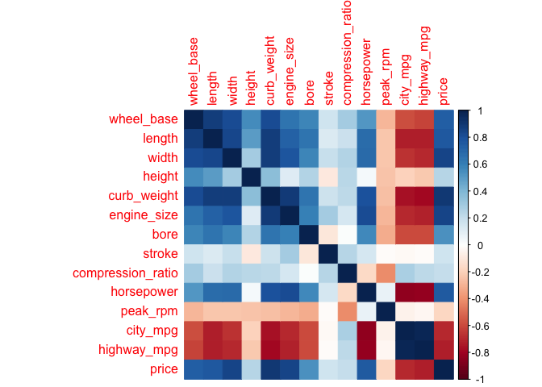
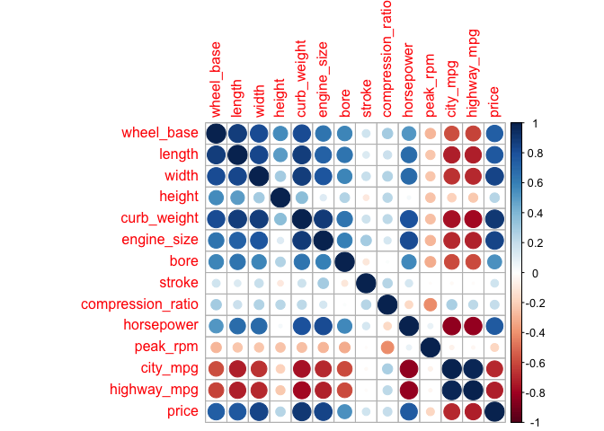

hw01-Shrey-Samdani
================

2. Data Import:
---------------

``` r
library(readr)

col_name <- c('symboling','normalized_losses', 'make', 'fuel_type', 'aspiration','num_of_doors','body_style', 'drive_wheels','engine_location','wheel_base', 'length','width','height','curb_weight','engine_type','num_of_cylinders','engine_size','fuel_system','bore','stroke','compression_ratio','horsepower','peak_rpm','city_mpg','highway_mpg','price')

col_type <- c('integer','real',rep('character',7),rep('real',4),'integer',rep('character',2),'real','character',rep('real',3),rep('integer',5))

data1 = read.csv(
  'imports-85.data',
  col.names = col_name,
 # colClasses = col_type,
  sep = ",",
  na.strings = '?'
)
str(data1)
```

    ## 'data.frame':    204 obs. of  26 variables:
    ##  $ symboling        : int  3 1 2 2 2 1 1 1 0 2 ...
    ##  $ normalized_losses: int  NA NA 164 164 NA 158 NA 158 NA 192 ...
    ##  $ make             : Factor w/ 22 levels "alfa-romero",..: 1 1 2 2 2 2 2 2 2 3 ...
    ##  $ fuel_type        : Factor w/ 2 levels "diesel","gas": 2 2 2 2 2 2 2 2 2 2 ...
    ##  $ aspiration       : Factor w/ 2 levels "std","turbo": 1 1 1 1 1 1 1 2 2 1 ...
    ##  $ num_of_doors     : Factor w/ 2 levels "four","two": 2 2 1 1 2 1 1 1 2 2 ...
    ##  $ body_style       : Factor w/ 5 levels "convertible",..: 1 3 4 4 4 4 5 4 3 4 ...
    ##  $ drive_wheels     : Factor w/ 3 levels "4wd","fwd","rwd": 3 3 2 1 2 2 2 2 1 3 ...
    ##  $ engine_location  : Factor w/ 2 levels "front","rear": 1 1 1 1 1 1 1 1 1 1 ...
    ##  $ wheel_base       : num  88.6 94.5 99.8 99.4 99.8 ...
    ##  $ length           : num  169 171 177 177 177 ...
    ##  $ width            : num  64.1 65.5 66.2 66.4 66.3 71.4 71.4 71.4 67.9 64.8 ...
    ##  $ height           : num  48.8 52.4 54.3 54.3 53.1 55.7 55.7 55.9 52 54.3 ...
    ##  $ curb_weight      : int  2548 2823 2337 2824 2507 2844 2954 3086 3053 2395 ...
    ##  $ engine_type      : Factor w/ 7 levels "dohc","dohcv",..: 1 6 4 4 4 4 4 4 4 4 ...
    ##  $ num_of_cylinders : Factor w/ 7 levels "eight","five",..: 3 4 3 2 2 2 2 2 2 3 ...
    ##  $ engine_size      : int  130 152 109 136 136 136 136 131 131 108 ...
    ##  $ fuel_system      : Factor w/ 8 levels "1bbl","2bbl",..: 6 6 6 6 6 6 6 6 6 6 ...
    ##  $ bore             : num  3.47 2.68 3.19 3.19 3.19 3.19 3.19 3.13 3.13 3.5 ...
    ##  $ stroke           : num  2.68 3.47 3.4 3.4 3.4 3.4 3.4 3.4 3.4 2.8 ...
    ##  $ compression_ratio: num  9 9 10 8 8.5 8.5 8.5 8.3 7 8.8 ...
    ##  $ horsepower       : int  111 154 102 115 110 110 110 140 160 101 ...
    ##  $ peak_rpm         : int  5000 5000 5500 5500 5500 5500 5500 5500 5500 5800 ...
    ##  $ city_mpg         : int  21 19 24 18 19 19 19 17 16 23 ...
    ##  $ highway_mpg      : int  27 26 30 22 25 25 25 20 22 29 ...
    ##  $ price            : int  16500 16500 13950 17450 15250 17710 18920 23875 NA 16430 ...

``` r
data2 = read_csv(
  'imports-85.data',
  col_names = col_name,
  col_types = "idcccccccddddiccdcdddiiiii",
  na = '?'
)

str(data2)
```

    ## Classes 'tbl_df', 'tbl' and 'data.frame':    205 obs. of  26 variables:
    ##  $ symboling        : int  3 3 1 2 2 2 1 1 1 0 ...
    ##  $ normalized_losses: num  NA NA NA 164 164 NA 158 NA 158 NA ...
    ##  $ make             : chr  "alfa-romero" "alfa-romero" "alfa-romero" "audi" ...
    ##  $ fuel_type        : chr  "gas" "gas" "gas" "gas" ...
    ##  $ aspiration       : chr  "std" "std" "std" "std" ...
    ##  $ num_of_doors     : chr  "two" "two" "two" "four" ...
    ##  $ body_style       : chr  "convertible" "convertible" "hatchback" "sedan" ...
    ##  $ drive_wheels     : chr  "rwd" "rwd" "rwd" "fwd" ...
    ##  $ engine_location  : chr  "front" "front" "front" "front" ...
    ##  $ wheel_base       : num  88.6 88.6 94.5 99.8 99.4 ...
    ##  $ length           : num  169 169 171 177 177 ...
    ##  $ width            : num  64.1 64.1 65.5 66.2 66.4 66.3 71.4 71.4 71.4 67.9 ...
    ##  $ height           : num  48.8 48.8 52.4 54.3 54.3 53.1 55.7 55.7 55.9 52 ...
    ##  $ curb_weight      : int  2548 2548 2823 2337 2824 2507 2844 2954 3086 3053 ...
    ##  $ engine_type      : chr  "dohc" "dohc" "ohcv" "ohc" ...
    ##  $ num_of_cylinders : chr  "four" "four" "six" "four" ...
    ##  $ engine_size      : num  130 130 152 109 136 136 136 136 131 131 ...
    ##  $ fuel_system      : chr  "mpfi" "mpfi" "mpfi" "mpfi" ...
    ##  $ bore             : num  3.47 3.47 2.68 3.19 3.19 3.19 3.19 3.19 3.13 3.13 ...
    ##  $ stroke           : num  2.68 2.68 3.47 3.4 3.4 3.4 3.4 3.4 3.4 3.4 ...
    ##  $ compression_ratio: num  9 9 9 10 8 8.5 8.5 8.5 8.3 7 ...
    ##  $ horsepower       : int  111 111 154 102 115 110 110 110 140 160 ...
    ##  $ peak_rpm         : int  5000 5000 5000 5500 5500 5500 5500 5500 5500 5500 ...
    ##  $ city_mpg         : int  21 21 19 24 18 19 19 19 17 16 ...
    ##  $ highway_mpg      : int  27 27 26 30 22 25 25 25 20 22 ...
    ##  $ price            : int  13495 16500 16500 13950 17450 15250 17710 18920 23875 NA ...
    ##  - attr(*, "spec")=List of 2
    ##   ..$ cols   :List of 26
    ##   .. ..$ symboling        : list()
    ##   .. .. ..- attr(*, "class")= chr  "collector_integer" "collector"
    ##   .. ..$ normalized_losses: list()
    ##   .. .. ..- attr(*, "class")= chr  "collector_double" "collector"
    ##   .. ..$ make             : list()
    ##   .. .. ..- attr(*, "class")= chr  "collector_character" "collector"
    ##   .. ..$ fuel_type        : list()
    ##   .. .. ..- attr(*, "class")= chr  "collector_character" "collector"
    ##   .. ..$ aspiration       : list()
    ##   .. .. ..- attr(*, "class")= chr  "collector_character" "collector"
    ##   .. ..$ num_of_doors     : list()
    ##   .. .. ..- attr(*, "class")= chr  "collector_character" "collector"
    ##   .. ..$ body_style       : list()
    ##   .. .. ..- attr(*, "class")= chr  "collector_character" "collector"
    ##   .. ..$ drive_wheels     : list()
    ##   .. .. ..- attr(*, "class")= chr  "collector_character" "collector"
    ##   .. ..$ engine_location  : list()
    ##   .. .. ..- attr(*, "class")= chr  "collector_character" "collector"
    ##   .. ..$ wheel_base       : list()
    ##   .. .. ..- attr(*, "class")= chr  "collector_double" "collector"
    ##   .. ..$ length           : list()
    ##   .. .. ..- attr(*, "class")= chr  "collector_double" "collector"
    ##   .. ..$ width            : list()
    ##   .. .. ..- attr(*, "class")= chr  "collector_double" "collector"
    ##   .. ..$ height           : list()
    ##   .. .. ..- attr(*, "class")= chr  "collector_double" "collector"
    ##   .. ..$ curb_weight      : list()
    ##   .. .. ..- attr(*, "class")= chr  "collector_integer" "collector"
    ##   .. ..$ engine_type      : list()
    ##   .. .. ..- attr(*, "class")= chr  "collector_character" "collector"
    ##   .. ..$ num_of_cylinders : list()
    ##   .. .. ..- attr(*, "class")= chr  "collector_character" "collector"
    ##   .. ..$ engine_size      : list()
    ##   .. .. ..- attr(*, "class")= chr  "collector_double" "collector"
    ##   .. ..$ fuel_system      : list()
    ##   .. .. ..- attr(*, "class")= chr  "collector_character" "collector"
    ##   .. ..$ bore             : list()
    ##   .. .. ..- attr(*, "class")= chr  "collector_double" "collector"
    ##   .. ..$ stroke           : list()
    ##   .. .. ..- attr(*, "class")= chr  "collector_double" "collector"
    ##   .. ..$ compression_ratio: list()
    ##   .. .. ..- attr(*, "class")= chr  "collector_double" "collector"
    ##   .. ..$ horsepower       : list()
    ##   .. .. ..- attr(*, "class")= chr  "collector_integer" "collector"
    ##   .. ..$ peak_rpm         : list()
    ##   .. .. ..- attr(*, "class")= chr  "collector_integer" "collector"
    ##   .. ..$ city_mpg         : list()
    ##   .. .. ..- attr(*, "class")= chr  "collector_integer" "collector"
    ##   .. ..$ highway_mpg      : list()
    ##   .. .. ..- attr(*, "class")= chr  "collector_integer" "collector"
    ##   .. ..$ price            : list()
    ##   .. .. ..- attr(*, "class")= chr  "collector_integer" "collector"
    ##   ..$ default: list()
    ##   .. ..- attr(*, "class")= chr  "collector_guess" "collector"
    ##   ..- attr(*, "class")= chr "col_spec"

3. Technical Questions about importing data
-------------------------------------------

1.  If you don’t provide a vector of column names, what happens to the column names of the imported data when you simply invoke read.csv('imports-85.data')?
    The column names are automatically generated based on the first item in the columns.

2.  If you don’t provide a vector of column names, what happens to the column names of the imported data when you invoke read.csv('imports-85.data', header = FALSE)?
    The columns get automatically in numerical order (V1, V2, V3...).

3.  When using the reading table functions, if you don’t specify how missing values are codified, what happens to the data type of those columns that contain '?', e.g. price or num\_of\_doors?
    If the data type is not character, then the read table functions will fail to read. Otherwise it will read as a character/string.

4.  Say you import imports-85.data in two different ways. In the first option you import the data without specifying the data type of each column. In the second option you do specify the data types. You may wonder whether both options return a data frame of the same memory size. You can actually use the function object.size() that provides an estimate of the memory that is being used to store an R object. Why is the data frame imported in the second option bigger (in terms of bytes) than the data frame imported in the first option?
    There are certain column types which are specified as integers in the first option but doubles in the second. Since doubles take up more memory, the second option would be bigger.

5.  Say the object dat is the data frame produced when importing imports-85.data. What happens to the data values if you convert dat as an R matrix? The data frame becomes a matrix with one column and a row for each column. This row contains the type of its respective column and the number of elements in that column.

4. Practice base plotting
-------------------------

#### histogram of price with colored bars.

``` r
price <- data1[,c('price')]
hist(x = price, col = 'blue')
```


Clearly, there is a much bigger frequency of cheaper cars (around 10000) than expensive cars. The resulting histogram is skewed to the right.

#### boxplot of horsepower in horizontal orientation.

``` r
horsepower <- data1[,c('horsepower')]
boxplot(x = horsepower, horizontal = TRUE)
```


The median horsepower lies at around 100, with quartiles at around 75 and 125. Most of the other values fall within the range of around 50 and 190. There are also 4 outliers with horsepowers greater than 200.

#### barplot of the frequencies of body\_style, arranged in decreasing order.

``` r
body_style <- sort(table(data1[,c('body_style')]), decreasing = TRUE)
barplot(height = body_style)
```


Sedans and hatchbacks are the most frequently occurring cars, followed by wagons, hardtops, and convertibles.

#### stars() plot of vehicles with turbo aspiration, using only variables wheel-base,length, width, height, and price.

``` r
library(dplyr)
```

    ## 
    ## Attaching package: 'dplyr'

    ## The following objects are masked from 'package:stats':
    ## 
    ##     filter, lag

    ## The following objects are masked from 'package:base':
    ## 
    ##     intersect, setdiff, setequal, union

``` r
x <- select(filter(data1, aspiration == 'turbo'), wheel_base, length, width, height)
stars(x)
```


Based on the star plot, it seems that the proportion of wheel\_base, length, width, height are generally constant. The wheel\_base and width are also more frequently of higher value than the other variables. The actual proportions for each turbo vehicle varies.

5. Summaries
------------

1.  What is the mean price of fuel\_type gas cars? And what is the mean price of fuel\_type diesel cars? (removing missing values)
    12913.19; 15838.15

2.  What is the make of the car with twelve num\_of\_cylinders?
    jaguar

3.  What is the make that has the most diesel cars?
    Peugot

4.  What is the price of the car with the largest amount of horsepower?
    36000

5.  What is the bottom 10th percentile of city\_mpg?
    17

6.  What is the top 10th percentile of highway\_mpg?
    38

7.  What is the median price of those cars in the bottom 10th percentile of city\_mpg?
    32250

``` r
# a
summarise(
  filter(data1, fuel_type == 'gas'),
  mean = mean(price, na.rm = TRUE)
)
```

    ##       mean
    ## 1 12913.19

``` r
summarise(
  filter(data1, fuel_type == 'diesel'),
  mean = mean(price, na.rm = TRUE)
)
```

    ##       mean
    ## 1 15838.15

``` r
#b
filter(data1, num_of_cylinders == 'twelve')
```

    ##   symboling normalized_losses   make fuel_type aspiration num_of_doors
    ## 1         0                NA jaguar       gas        std          two
    ##   body_style drive_wheels engine_location wheel_base length width height
    ## 1      sedan          rwd           front        102  191.7  70.6   47.8
    ##   curb_weight engine_type num_of_cylinders engine_size fuel_system bore
    ## 1        3950        ohcv           twelve         326        mpfi 3.54
    ##   stroke compression_ratio horsepower peak_rpm city_mpg highway_mpg price
    ## 1   2.76              11.5        262     5000       13          17 36000

``` r
#c
dat <- 
  arrange(
    mutate(
      group_by(filter(data1, fuel_type == 'diesel'), make), 
    count= n()), 
  desc(count))

head(dat,1)
```

    ## # A tibble: 1 x 27
    ## # Groups:   make [1]
    ##   symboling normalized_losses make   fuel_type aspiration num_of_doors
    ##       <int>             <int> <fct>  <fct>     <fct>      <fct>       
    ## 1         0               161 peugot diesel    turbo      four        
    ## # ... with 21 more variables: body_style <fct>, drive_wheels <fct>,
    ## #   engine_location <fct>, wheel_base <dbl>, length <dbl>, width <dbl>,
    ## #   height <dbl>, curb_weight <int>, engine_type <fct>,
    ## #   num_of_cylinders <fct>, engine_size <int>, fuel_system <fct>,
    ## #   bore <dbl>, stroke <dbl>, compression_ratio <dbl>, horsepower <int>,
    ## #   peak_rpm <int>, city_mpg <int>, highway_mpg <int>, price <int>,
    ## #   count <int>

``` r
#d
dat <- select(arrange(data1, desc(horsepower)),price)
head(dat, 5)
```

    ##   price
    ## 1    NA
    ## 2 36000
    ## 3 32528
    ## 4 34028
    ## 5 37028

``` r
#e
quantile(data1[,c("city_mpg")],0.1, na.rm = TRUE)
```

    ## 10% 
    ##  17

``` r
#f
quantile(data1[,c("highway_mpg")],0.9, na.rm = TRUE)
```

    ## 90% 
    ##  38

``` r
#g
quant  =  quantile(data1[,c("city_mpg")],0.1, na.rm = TRUE)
dat <- select(filter(data1,city_mpg <= unname(quant)), price)
quantile(dat, 0.5, na.rm = TRUE)
```

    ##   50% 
    ## 32250

6. Technical Questions about data frames
----------------------------------------

1.  What happens when you use the dollar $ operator on a data frame, attempting to use the name of a column that does not exist? For example: dat$xyz where there is no column named xyz.
    It will return NULL.

2.  Which of the following commands fails to return the vector mpg which is a column in the built-in data rfame mtcars:

<!-- -->

1.  mtcars$mpg
2.  mtcars\[ ,1\]
3.  mtcars\[\[1\]\]
4.  mtcars\[ ,mpg\] &lt; WILL FAIL
5.  mtcars\[\["mpg"\]\]
6.  mtcars$"mpg"
7.  mtcars\[ ,"mpg"\]

<!-- -->

1.  Based on your answer for part (b), what is the reason that makes such command to fail?
    There is no object called mpg; the column name is the string 'mpg'.

2.  Can you include an R list as a “column” of a data frame? YES or NO, and why.
    YES; the command \[data frame\]$\[column name\] &lt;- \[list\] will add the column, as long as the number of rows matches up.

3.  What happens when you apply as.list() to a data frame? e.g. as.list(mtcars)
    A nested list will be returned (subscript once to get a column, subscript twice to get the row from that column).

4.  Consider the command: abc &lt;- as.list(mtcars). What function(s) can you use to convert the object abc into a data frame?
    data.frame(abc)

7. Correlations of quantitative variables
-----------------------------------------

``` r
library(corrplot)
```

    ## corrplot 0.84 loaded

``` r
qdat <- select_if(na.omit(data1), is.numeric)
M <- cor(qdat)
```

``` r
corrplot(M, method = 'color')
```



``` r
corrplot(M, method = 'circle')
```



Based on the correlograms, there are few main patterns that can be observed. The first is that there is a strong correlation between the size features of the auto (wheel\_base, length ... bore). The second is that the size and the mpg are highly uncorrelated. The city\_mpg and highway\_mpg are also strongly correlated with each other. The price and horsepower are also positively correlated with the size, showing that bigger cars seem to cost more. It also implies that more expensive cars have worse mpg but more horsepower. Everything else is insignificant and relatively uncorrelated.
