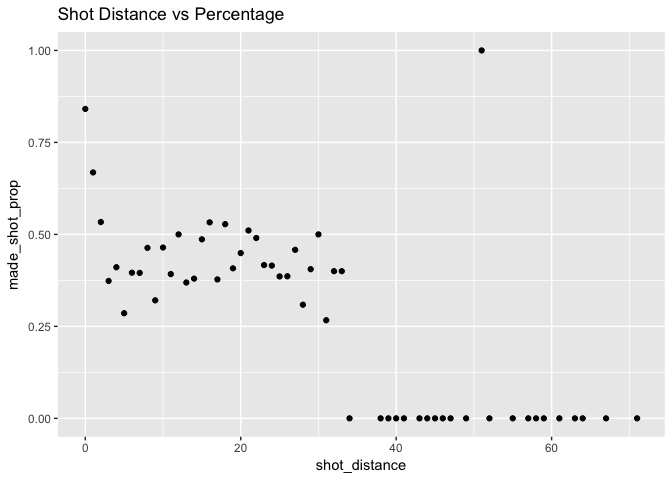

Hw02-shrey-samdani
================
Shrey Samdani

``` r
# import packages
library(dplyr)
```

    ## 
    ## Attaching package: 'dplyr'

    ## The following objects are masked from 'package:stats':
    ## 
    ##     filter, lag

    ## The following objects are masked from 'package:base':
    ## 
    ##     intersect, setdiff, setequal, union

``` r
library(ggplot2)
```

``` r
# create charts
dat <- read.csv(file = '../data/shots-data.csv')

total_points <- 
dat %>%
  select(name) %>%
  group_by(name) %>%
  summarize(
    total = length(name)
  ) %>%
  arrange(desc(name))

esp <- 
  dat %>%
  select(name, shot_made_flag) %>%
  group_by(name) %>%
  summarize(
    total = length(name),
    made = length(shot_made_flag[shot_made_flag =='made shot']),
    perc_made = 100* made/total
  ) %>%
  arrange(desc(perc_made))

twopt <- 
  dat %>%
  select(name, shot_made_flag, shot_type) %>%
  group_by(name) %>%
  summarize(
    total = length(shot_type[shot_type == '2PT Field Goal']),
    made = length(shot_made_flag[shot_made_flag =='made shot' & shot_type == '2PT Field Goal']),
    perc_made = 100* made/total
  ) %>%
  arrange(desc(perc_made))

threept <- 
  dat %>%
  select(name, shot_made_flag, shot_type) %>%
  group_by(name) %>%
  summarize(
    total = length(shot_type[shot_type == '3PT Field Goal']),
    made = length(shot_made_flag[shot_made_flag =='made shot' & shot_type == '3PT Field Goal']),
    perc_made = 100* made/total
  ) %>%
  arrange(desc(perc_made))

esp
```

    ## # A tibble: 5 x 4
    ##   name           total  made perc_made
    ##   <fct>          <int> <int>     <dbl>
    ## 1 Kevin Durant     915   495      54.1
    ## 2 Andre Iguodala   371   192      51.8
    ## 3 Klay Thompson   1220   575      47.1
    ## 4 Stephen Curry   1250   584      46.7
    ## 5 Draymond Green   578   245      42.4

``` r
twopt
```

    ## # A tibble: 5 x 4
    ##   name           total  made perc_made
    ##   <fct>          <int> <int>     <dbl>
    ## 1 Andre Iguodala   210   134      63.8
    ## 2 Kevin Durant     643   390      60.7
    ## 3 Stephen Curry    563   304      54.0
    ## 4 Klay Thompson    640   329      51.4
    ## 5 Draymond Green   346   171      49.4

``` r
threept
```

    ## # A tibble: 5 x 4
    ##   name           total  made perc_made
    ##   <fct>          <int> <int>     <dbl>
    ## 1 Klay Thompson    580   246      42.4
    ## 2 Stephen Curry    687   280      40.8
    ## 3 Kevin Durant     272   105      38.6
    ## 4 Andre Iguodala   161    58      36.0
    ## 5 Draymond Green   232    74      31.9

``` r
distances <- 
  dat %>%
  select(shot_distance, shot_made_flag) %>%
  group_by(shot_distance) %>%
  summarize(
    made_shot_prop = length(shot_made_flag[shot_made_flag == 'made shot']) / n()
  ) %>%
  arrange(shot_distance)

distances
```

    ## # A tibble: 56 x 2
    ##    shot_distance made_shot_prop
    ##            <int>          <dbl>
    ##  1             0          0.841
    ##  2             1          0.668
    ##  3             2          0.534
    ##  4             3          0.373
    ##  5             4          0.411
    ##  6             5          0.286
    ##  7             6          0.396
    ##  8             7          0.395
    ##  9             8          0.463
    ## 10             9          0.321
    ## # ... with 46 more rows

``` r
ggplot(data = distances) + 
  geom_point(aes(x = shot_distance, y = made_shot_prop)) + 
  ggtitle('Shot Distance vs Percentage')
```



-   What do you observe?
    As the distance increases, the shot percentage follows a downward trend.

-   Can you confirm that the shorter the distance, the more effective the shots? No; there are some data points that are higher in shot\_distance but lower in made\_shot\_prop.

-   Can you guesstimate a distance threshold beyond which the chance of making a successful shot is basically null?
    At/after around 34, most of the shots have a 0 proportion of success.

-   What distances tend to have a percentage (of making a shot) of 50% or more?
    According to the graph, the distances 0,1,2,12,16,18,21,30,51 have a percentage of 50 or more.

``` r
data <- dat %>%
  select(name ,minute, period) %>%
  group_by(name,minute, period) %>%
  summarize(
    total_shots = n()
  ) %>%
  arrange(minute)
data
```

    ## # A tibble: 233 x 4
    ## # Groups:   name, minute [233]
    ##    name           minute period total_shots
    ##    <fct>           <int>  <int>       <int>
    ##  1 Draymond Green      1      1          18
    ##  2 Kevin Durant        1      1          31
    ##  3 Klay Thompson       1      1          35
    ##  4 Stephen Curry       1      1          21
    ##  5 Draymond Green      2      1          10
    ##  6 Kevin Durant        2      1          26
    ##  7 Klay Thompson       2      1          42
    ##  8 Stephen Curry       2      1          28
    ##  9 Draymond Green      3      1          21
    ## 10 Kevin Durant        3      1          26
    ## # ... with 223 more rows

``` r
ggplot(data = data, aes(x = minute, y = total_shots, xmin = (period %% 2)*24, xmax = (period %% 2)*24 + 12, ymin = 0, ymax = 60 )) + 
  scale_x_continuous(breaks = c(12,24,36,48)) + 
  geom_rect(fill = 'gray95') +
  geom_point(color = rgb(73,140,251,maxColorValue = 255)) +
  geom_path(color = rgb(73,140,251,maxColorValue = 255)) +
  theme_minimal() +
  labs(y= 'total number of shots',title ="Total number of shots (by minute of occurrence)") +
  facet_wrap(~ name)
```


