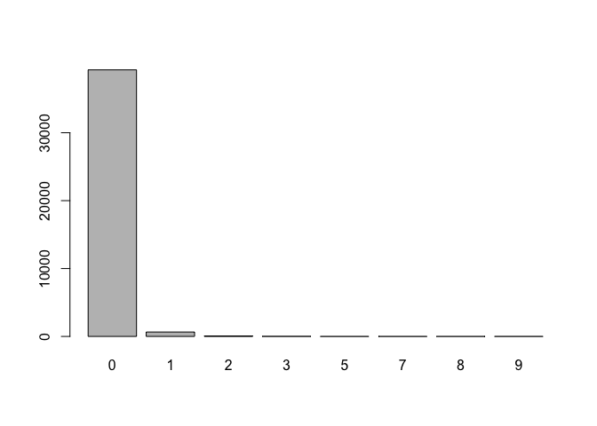

Hw04-shrey-samdani
================

Archive of an R Package
-----------------------

``` r
source("../code/archive-functions.R")

raw_data <- read_archive('stringr')
clean_data <- clean_archive(raw_data)
write.csv(clean_data, file = "../data/stringr-archive.csv" )
plot_archive(clean_data)
```


``` r
facetedData = data.frame()
packages = c("ggplot2", "XML", "knitr", "dplyr")
for (package in packages) {
  raw_data <- read_archive(package)
  clean_data <- clean_archive(raw_data)
  write.csv(clean_data, file = paste0("../data/",package,"-archive.csv" ))
  clean_data$type = package
  facetedData <- rbind(facetedData, clean_data)
}
```

``` r
ggplot(data = facetedData, aes(x = date, y = size, color = type)) +
  geom_step() + 
  labs(y = 'Size (KB)')
```


``` r
ggplot(data = facetedData, aes(x = date, y = size, color = type)) +
  geom_step() + 
  labs(y = 'Size (KB)') + 
  facet_wrap(~ type, scales = 'free')
```


Regex Functions
---------------

``` r
source("../code/regex-functions.R")

split_chars('Go Bears!')
```

    ## [1] "G" "o" " " "B" "e" "a" "r" "s" "!"

``` r
split_chars('Expecto Patronum')
```

    ##  [1] "E" "x" "p" "e" "c" "t" "o" " " "P" "a" "t" "r" "o" "n" "u" "m"

``` r
vec <- c('G', 'o', ' ', 'B', 'e', 'a', 'r', 's', '!')
num_vowels(vec)
```

    ## a e i o u 
    ## 1 1 0 1 0

``` r
count_vowels("The quick brown fox jumps over the lazy dog")
```

    ## a e i o u 
    ## 1 3 1 4 2

``` r
count_vowels("THE QUICK BROWN FOX JUMPS OVER THE LAZY DOG")
```

    ## a e i o u 
    ## 1 3 1 4 2

``` r
reverse_chars("gattaca")
```

    ## [1] "acattag"

``` r
reverse_chars("Lumox Maxima")
```

    ## [1] "amixaM xomuL"

``` r
reverse_words("sentence! this reverse")
```

    ## [1] "reverse this sentence!"

``` r
reverse_words("string")
```

    ## [1] "string"

Data “Emotion in Text”
----------------------

``` r
content = read.csv("../data/text-emotion.csv", stringsAsFactors = F)$content
```

### 3.1) Number of characters per tweet

``` r
counts = nchar(content)
print(summary(counts))
```

    ##    Min. 1st Qu.  Median    Mean 3rd Qu.    Max. 
    ##    1.00   43.00   69.00   73.41  103.00  167.00

``` r
hist(counts, breaks = seq(0, max(counts)+5, by=5))
```


### 3.2) Number of Mentions

``` r
mentions = unlist(lapply(content, 
                         function(x) length(grep("^[^@@]*@[A-Za-z0-9_]{1,15}$",
                                                 str_split(x, " ")[[1]]))))
menCounts = table(mentions)
barplot(menCounts)
```


``` r
menCounts
```

    ## mentions
    ##     0     1     2     3     4     5     6     7     8     9    10 
    ## 21375 17933   569    75    28    13     2     1     2     1     1

``` r
content[mentions == 5]
```

    ##  [1] "@FrankieTheSats @MollieOfficial @Rochellewiseman @Unahealy @vanessawhite Post man Pat has now been &amp; still no birthday cards from yous?!"
    ##  [2] "YM, meebo &amp; ebuddy really hate us  @kuhrabbyPATTY @whatsuppp @ashpolicarpio @cheyennelaxa @piaatrinidad"                                 
    ##  [3] "ok @shaaqt @spitphyre @limeice @unitechy @punkpolkadots Love you girls. but work beckons.  Will come back later for #twpp"                   
    ##  [4] "I wish I was going to see @patmaine @johnmaine @garrettmaine @jaredmaine @kennedymaine today!! I'm sad I dont"                               
    ##  [5] "#followfriday @nickw84 @kevkevv @vjartist @liverpool10 follow these ppl ... they are interesting .. @vjartist doesnt tweet much though"      
    ##  [6] "and these awesome tweeples too!  @xoNessCullenxo @xoJasperHalexo @xoEmmettC35xo @oxTanyaDenaliox @xoEsmeCullenxo"                            
    ##  [7] "@dmeeker @alanstevens  @scrum_coach @sethrowe @scottreynolds IMHO this soft is the best to keep the chaos straight   http://bit.ly/yuFil"    
    ##  [8] "Although it is becoming Tuesday (soon) in New Zealand  * @bigbdisco @by_starla @tubilino @LittleC @asterion H... ? http://blip.fm/~5jhim"    
    ##  [9] "http://twitpic.com/4iw0x @JerryKontur @rvitek @carolwingert @Weidling @joereist Thx all - it's a 3k capacity, bought second hand"            
    ## [10] "@Nabaishko @BADDASSTWIN @DJPLAYBOY @GREENARROW09 @Kellynico  get lit  I am  http://bit.ly/OASQR"                                             
    ## [11] "@_Bella_Cullen13 @RosalieHCullen @Esme_Cullen26 @alicecullen01 @NeSsIe_Cullen10  These are my family girls  love u guys *smiles*"            
    ## [12] "Thanks to: @soultravelers3 @marcphotoshow @WorldTravelBlog @cthechange @annaphoto New followers!"                                            
    ## [13] "@jaredmaine @kennedymaine @johnmaine @patmaine @garrettmaine I LOVE YOU GUYS! get your ass to australia in december for my birthday"

### 3.3) Hashtags

``` r
# total hashtags in each tweet
hashtags = 1:length(content)

# lengths of hashtags in each tweet
hashtagLengths = rep(0,max(counts))

for (i in hashtags) {
  
  # split up the tweet into words
  tweetWords = str_split(content[i], " ")[[1]]
  
  # find the hashtags
  whichTags = grep("#[A-Za-z][A-Za-z0-9]*", tweetWords, value = T)
  
  # find the lengths of the hashtags
  lengthIndices = nchar(whichTags) - 1
  
  # add to the table length
  hashtagLengths[lengthIndices] = hashtagLengths[lengthIndices] + 1
  
  # count how many hashtags there are
  hashtags[i] = length(whichTags)
}

names(hashtagLengths) <- 1:(length(hashtagLengths))

# get the frequencies of the number of hashtags in a tweet
hashCounts = table(hashtags)

#frequencies of counts
hashCounts
```

    ## hashtags
    ##     0     1     2     3     5     7     8     9 
    ## 39261   650    66    17     1     1     1     3

``` r
barplot(hashCounts)
```



``` r
#avg length of hashtags
sum(hashtagLengths*as.numeric(names(hashtagLengths))/sum(hashtagLengths))
```

    ## [1] 7.963592

``` r
#mode of the length
names(hashtagLengths[hashtagLengths == max(hashtagLengths)])
```

    ## [1] "4"
