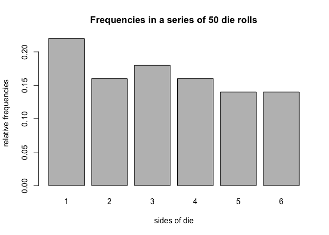
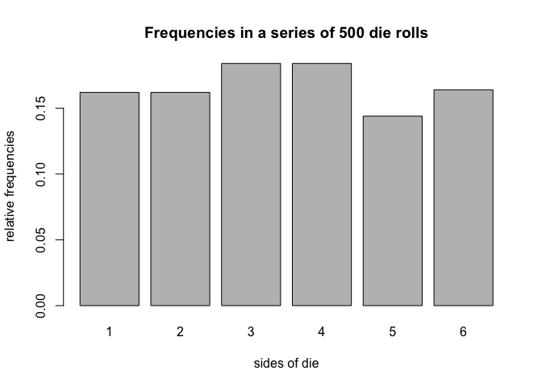

hw05
================

1) Object "die"
---------------

``` r
# default call: creates a standard fair die
fair_die <- die()
fair_die
```

    ## object "die"
    ## 
    ##   side      prob
    ## 1    1 0.1666667
    ## 2    2 0.1666667
    ## 3    3 0.1666667
    ## 4    4 0.1666667
    ## 5    5 0.1666667
    ## 6    6 0.1666667

``` r
# die with non-standard sides
weird_die <- die(sides = c('i', 'ii', 'iii', 'iv', 'v', 'vi'))
weird_die
```

    ## object "die"
    ## 
    ##   side      prob
    ## 1    i 0.1666667
    ## 2   ii 0.1666667
    ## 3  iii 0.1666667
    ## 4   iv 0.1666667
    ## 5    v 0.1666667
    ## 6   vi 0.1666667

``` r
# create a loaded die
loaded_die <- die(prob = c(0.075, 0.1, 0.125, 0.15, 0.20, 0.35))
loaded_die
```

    ## object "die"
    ## 
    ##   side  prob
    ## 1    1 0.075
    ## 2    2 0.100
    ## 3    3 0.125
    ## 4    4 0.150
    ## 5    5 0.200
    ## 6    6 0.350

``` r
# bad sides
bad_die <- die(sides = c('a', 'b', 'c', 'd', 'e'))
```

    ## Error in check_sides(sides): 
    ## 'prob' must be a vector of length 6

``` r
# bad prob
bad_die <- die(
sides = c('a', 'b', 'c', 'd', 'e', 'f'),
prob = c(0.2, 0.1, 0.1, 0.1, 0.5, 0.1))
```

    ## Error in check_prob(prob): 
    ## elements in 'prob' must add up to 1

2) Object "roll"
----------------

``` r
# roll fair die 50 times
fair_die <- die()

# roll 50 times
set.seed(123)
fair_50 <- roll(fair_die, times = 50)

# print
fair_50
```

    ## object "roll"
    ## 
    ##  [1] 3 6 4 1 1 2 5 1 5 4 1 4 6 5 2 1 3 2 3 1 1 6 5 1 5 6 5 5 3 2 1 1 6 6 2
    ## [36] 4 6 3 3 3 2 4 4 4 2 2 3 4 3 1

``` r
# what's in fair50?
names(fair_50)
```

    ## [1] "rolls" "sides" "prob"  "total"

``` r
fair_50$rolls
```

    ##  [1] 3 6 4 1 1 2 5 1 5 4 1 4 6 5 2 1 3 2 3 1 1 6 5 1 5 6 5 5 3 2 1 1 6 6 2
    ## [36] 4 6 3 3 3 2 4 4 4 2 2 3 4 3 1

``` r
fair_50$sides
```

    ## [1] 1 2 3 4 5 6

``` r
fair_50$prob
```

    ## [1] 0.1666667 0.1666667 0.1666667 0.1666667 0.1666667 0.1666667

``` r
fair_50$total
```

    ## [1] 50

3) Summary method for "roll" objects
------------------------------------

``` r
set.seed(123)
fair_50rolls <- roll(fair_die, times = 50)
fair50_sum <- summary(fair_50rolls)
fair50_sum
```

    ## summary "roll"
    ## 
    ##   side count prop
    ## 1    1    11 0.22
    ## 2    2     8 0.16
    ## 3    3     9 0.18
    ## 4    4     8 0.16
    ## 5    5     7 0.14
    ## 6    6     7 0.14

``` r
# what's in the summary
class(fair50_sum)
```

    ## [1] "summary.roll"

``` r
names(fair50_sum)
```

    ## [1] "freqs"

``` r
fair50_sum$freqs
```

    ##   side count prop
    ## 1    1    11 0.22
    ## 2    2     8 0.16
    ## 3    3     9 0.18
    ## 4    4     8 0.16
    ## 5    5     7 0.14
    ## 6    6     7 0.14

4) PLot method for "roll" objects
---------------------------------

``` r
# plot method
plot(fair_50rolls)
```



5) Additional Methods
---------------------

``` r
# roll fair die
set.seed(123)
fair_die <- die()
fair500 <- roll(fair_die, times = 500)

# summary method
summary(fair500)
```

    ## summary "roll"
    ## 
    ##   side count  prop
    ## 1    1    80 0.160
    ## 2    2    81 0.162
    ## 3    3    92 0.184
    ## 4    4    92 0.184
    ## 5    5    72 0.144
    ## 6    6    83 0.166

``` r
# extracting roll in position 500
fair500[500]
```

    ## [1] 6

``` r
summary(fair500)
```

    ## summary "roll"
    ## 
    ##   side count  prop
    ## 1    1    80 0.160
    ## 2    2    81 0.162
    ## 3    3    92 0.184
    ## 4    4    92 0.184
    ## 5    5    72 0.144
    ## 6    6    83 0.166

``` r
# replacing last roll
fair500[500] <- 1
fair500[500]
```

    ## [1] 1

``` r
summary(fair500)
```

    ## summary "roll"
    ## 
    ##   side count  prop
    ## 1    1    81 0.162
    ## 2    2    81 0.162
    ## 3    3    92 0.184
    ## 4    4    92 0.184
    ## 5    5    72 0.144
    ## 6    6    82 0.164

``` r
# adding 100 rolls
fair600 = fair500 + 100
summary(fair600)
```

    ## summary "roll"
    ## 
    ##   side count      prop
    ## 1    1   100 0.1666667
    ## 2    2    97 0.1616667
    ## 3    3   104 0.1733333
    ## 4    4   109 0.1816667
    ## 5    5    91 0.1516667
    ## 6    6    99 0.1650000

``` r
# plot method
plot(fair500, 500)
```



De Mere’s problem
-----------------

``` r
# Problem 1

fairDie = die()
sixes = 0
for (i in 1:1000) {
  trial = roll(fairDie, 4)
  if (is.element(6, trial$rolls)) {
    sixes = sixes + 1
  } 
}
sixes/1000
```

    ## [1] 0.526

``` r
# Problem 2
sixes = 0
for (i in 1:1000) {
  for (j in 1:24) {
    trial = roll(fairDie, 2)
    if (sum(trial$rolls == 6) == 2) {
      sixes = sixes + 1
      break
    }
  }
}
sixes / 1000
```

    ## [1] 0.462
